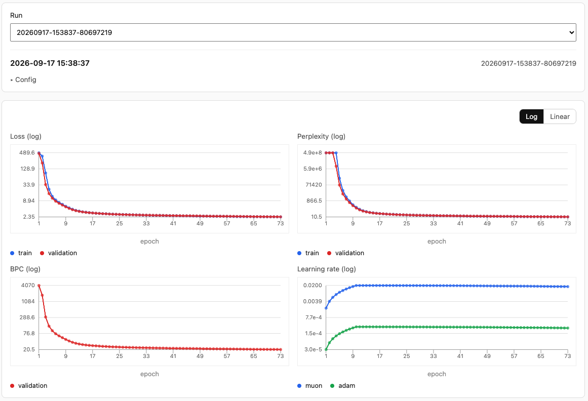
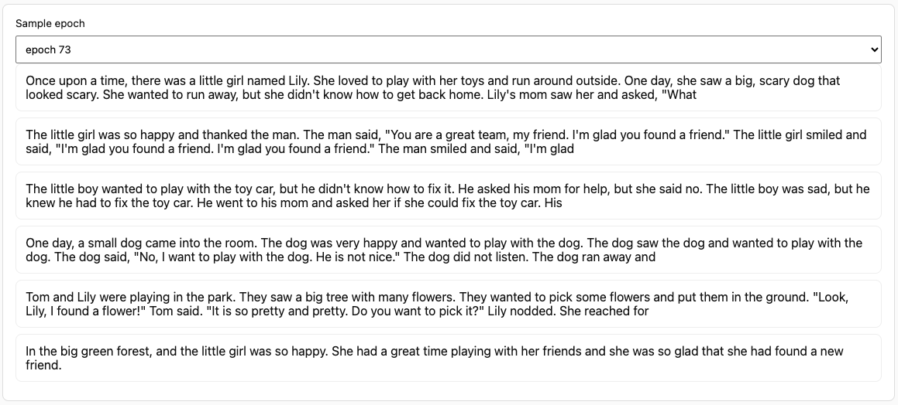
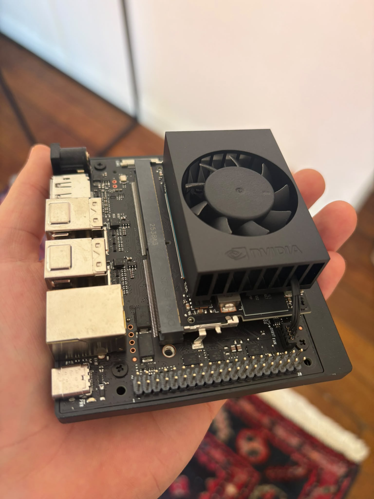

# slm

Looped decoder-only transformer trained on [TinyStories](https://huggingface.co/datasets/roneneldan/TinyStories). Hand-written architecture (RoPE, RMSNorm, SwiGLU, GQA) with Muon + AdamW optimization.

## Quick start

```bash
cd jetson
docker compose build
docker compose run --rm download
docker compose run --rm train-tokenizer
docker compose run --rm tokenize
docker compose run --rm train --preset tiny --epochs 10
docker compose run --rm generate runs/<run-id> --prompt "Once upon a time"
```

See [jetson/README.md](jetson/README.md), [docs/getting-started.md](docs/getting-started.md), [docs/cli.md](docs/cli.md), and [docs/runs.md](docs/runs.md).

## Runs & viz

[docs/runs.md](docs/runs.md)

Each run writes `history.json`, checkpoints, and per-epoch sample JSON under `runs/<run-id>/`. The viz page charts train/val metrics and shows generated text samples.

Train and validation metrics per epoch: loss, perplexity, BPC, and learning rates.

<p align="center">
  
</p>

Generated text samples at each saved epoch.

<p align="center">
  
</p>

```bash
cd jetson
docker compose up viz
# open http://localhost:8000/viz/
```

## Jetson Orin Nano

[jetson/README.md](jetson/README.md)

Docker setup for training and generation on **Jetson Orin Nano** (JetPack). Source is bind-mounted; rebuild only when dependencies change.

<p align="center">
  
</p>
